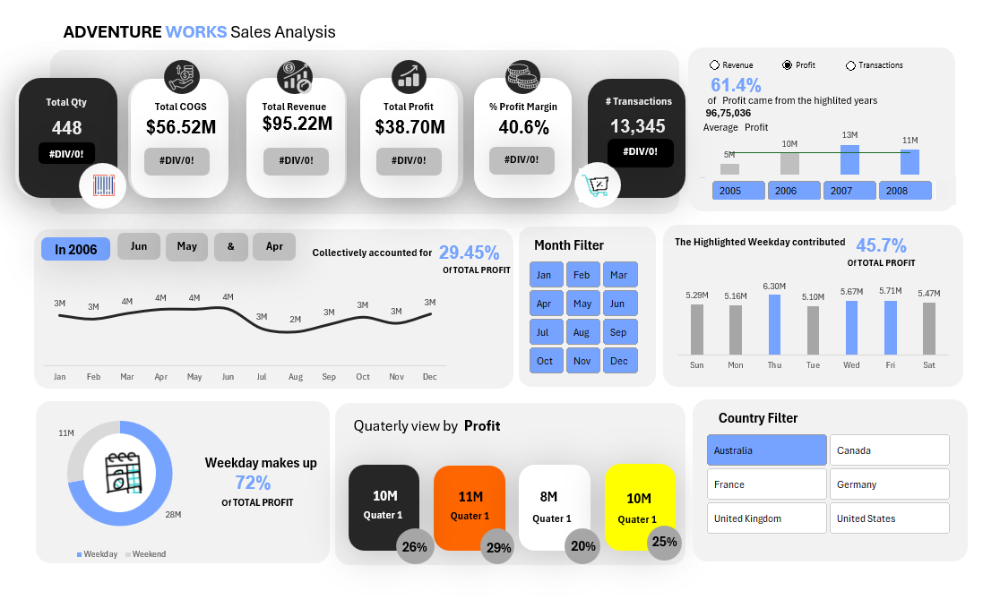

# Adventure Works Sales Performance Dashboard – Microsoft Excel
## Dashboard Preview

## Project Overview
This project involves the development of an **interactive sales performance and profitability dashboard** for the Adventure Works dataset using Microsoft Excel. The dashboard is designed to support **executive-level business analysis** by consolidating financial, transactional, and temporal performance metrics into a single analytical view.

The solution enables stakeholders to monitor **revenue, profit, cost structure, transaction volume, and margin performance**, while dynamically exploring trends across time, geography, and calendar dimensions.

## Scope of Analysis
- End-to-end data preparation and validation
- KPI modeling and profitability analysis
- Time-series trend analysis (monthly, quarterly, yearly)
- Transaction and weekday vs weekend contribution analysis
- Country-level performance comparison
- Interactive dashboard design and user-driven exploration

## Key Metrics & KPIs
- Total Revenue
- Total Profit
- Total Cost of Goods Sold (COGS)
- Profit Margin (%)
- Transaction Volume
- Average Profit
- Year-over-Year and period-based contribution analysis

## Analytical Components

### Time-Series & Period Analysis
- Monthly and yearly profit trends
- Quarterly profit comparison
- Identification of high-contributing time periods

### Profitability Analysis
- Revenue vs profit comparison
- Margin analysis to evaluate operational efficiency
- Contribution analysis for highlighted years and months

### Transaction & Calendar Insights
- Weekday vs weekend profit contribution
- Day-of-week performance analysis
- Identification of peak transaction periods

### Geographic Analysis
- Country-level sales and profit comparison
- Regional contribution assessment across global markets

## Dashboard Interactivity
- Dynamic filters for:
  - Year
  - Month
  - Country
- Interactive visuals enabling focused analysis without altering source data

## Tools & Techniques Used
- Microsoft Excel
  - Pivot Tables and Pivot Charts
  - Calculated KPIs and measures
  - Conditional formatting
  - Time-series analysis
  - Interactive slicers
- Dashboard design principles emphasizing clarity, hierarchy, and usability

No external tools, add-ins, or macros were used.

## Business Insights
- A limited number of time periods contribute a disproportionate share of total profit
- Weekday transactions account for the majority of profitability
- Profit margin trends highlight opportunities for operational optimization
- Geographic performance varies significantly across countries, indicating market-specific dynamics

## Files Included
- `Adventure Dashboard.xlsx` – Interactive Excel dashboard
- Dashboard preview image
